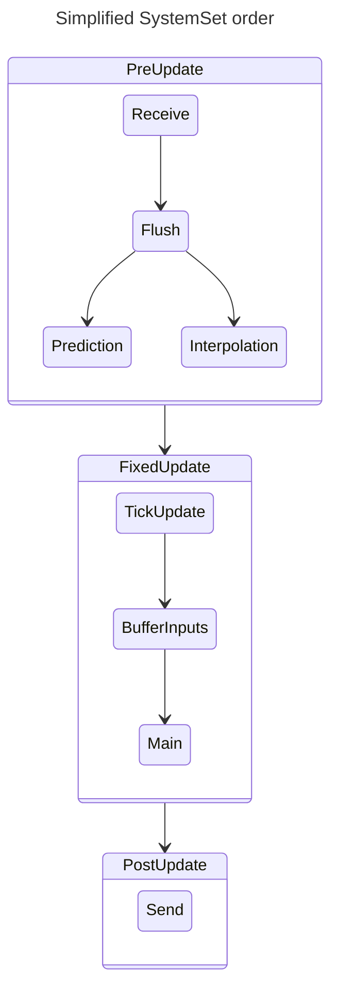

# System order

Lightyear provides several [`SystemSets`](bevy::prelude::SystemSet) that you can use to run your systems in the correct order.

The main things to keep in mind are:
- All packets are read during the `PreUpdate` schedule. This is also where all components that were received are replicated to the Client World.
- All packets are sent during the `PostUpdate` schedule. All messages that were buffered are then sent to the remote, and all replication messages (entity spawn, component updated, etc.) are also sent
- There are 2 [`SystemSets`](bevy::prelude::SystemSet) that you should interact with:
  - [`BufferInputs`](crate::prelude::BufferInputs): this is where you should be running `client.add_inputs()` so that they are buffered and sent to the server correctly
  - [`Main`](crate::prelude::Main): this is where all your [`FixedUpdate`](bevy::prelude::FixedUpdate) Schedule systems (physics, etc.) should be run, so that they interact correctly with client-side prediction, etc.

Here is a simplified version of the system order:

## Full system order

```mermaid
---
title: SystemSet order
---
stateDiagram-v2

   classDef flush font-style:italic;
   
   SpawnPredictionHistory : SpawnHistory
   SpawnInterpolationHistory : SpawnHistory
   SpawnPredictionHistoryFlush : Flush
   SpawnInterpolationHistoryFlush : Flush
   SpawnPredictionFlush : Flush
   SpawnInterpolationFlush: Flush
   CheckRollbackFlush: Flush
   DespawnFlush: Flush
   ReceiveFlush: Flush
   FixedUpdatePrediction: Prediction
   
   PreUpdate --> FixedUpdate
   FixedUpdate --> PostUpdate 
   state PreUpdate {
      Receive --> ReceiveFlush
      ReceiveFlush --> Prediction
      ReceiveFlush --> Interpolation
   }
   state Prediction {
      SpawnPrediction --> SpawnPredictionFlush
      SpawnPredictionFlush --> SpawnPredictionHistory
      SpawnPredictionHistory --> SpawnPredictionHistoryFlush
      SpawnPredictionHistoryFlush --> CheckRollback
      CheckRollback --> CheckRollbackFlush
      CheckRollbackFlush --> Rollback
   }
   state Interpolation {
       SpawnInterpolation --> SpawnInterpolationFlush
       SpawnInterpolationFlush --> SpawnInterpolationHistory
       SpawnInterpolationHistory --> SpawnInterpolationHistoryFlush
       SpawnInterpolationHistoryFlush --> Despawn
       Despawn --> DespawnFlush
       DespawnFlush --> Interpolate
   }
   state FixedUpdate {
      TickUpdate --> BufferInputs
      BufferInputs --> WriteInputEvent
      WriteInputEvent --> Main
      Main --> ClearInputEvent
      Main --> FixedUpdatePrediction
   }
   state FixedUpdatePrediction {
      PredictionEntityDespawn --> PredictionEntityDespawnFlush
      PredictionEntityDespawnFlush --> UpdatePredictionHistory
      UpdatePredictionHistory --> IncrementRollbackTick : if rollback
   }
   state PostUpdate {
        state Send {
            SendEntityUpdates --> SendComponentUpdates
            SendComponentUpdates --> SendInputMessage
            SendInputMessage --> SendPackets
        }
        --
        Sync
   }
```

