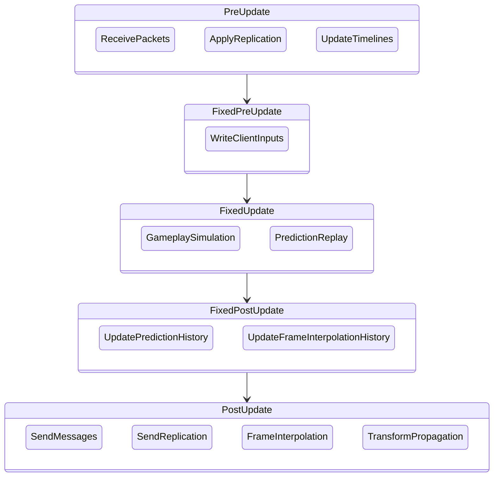

# System order

Lightyear works best when your networked gameplay has a clear place in Bevy's schedules.

The short version:

- receive packets before gameplay uses them
- write local inputs before fixed simulation
- run deterministic gameplay in `FixedUpdate`
- send packets after gameplay has produced changes
- keep visual smoothing out of the simulation state

## The common frame


```mermaid
stateDiagram-v2
    PreUpdate --> FixedPreUpdate
    FixedPreUpdate --> FixedUpdate
    FixedUpdate --> FixedPostUpdate
    FixedPostUpdate --> PostUpdate

    state PreUpdate {
        ReceivePackets
        ApplyReplication
        UpdateTimelines
    }

    state FixedPreUpdate {
        WriteClientInputs
    }

    state FixedUpdate {
        GameplaySimulation
        PredictionReplay
    }

    state FixedPostUpdate {
        UpdatePredictionHistory
        UpdateFrameInterpolationHistory
    }

    state PostUpdate {
        SendMessages
        SendReplication
        FrameInterpolation
        TransformPropagation
    }
```

This diagram is deliberately simplified. The exact internal sets move as Lightyear and Replicon evolve, but the ordering constraints are the part you should design around.

## Inputs

Buffer local inputs in `FixedPreUpdate`:

```rust,ignore
app.add_systems(
    FixedPreUpdate,
    buffer_input.in_set(InputSystems::WriteClientInputs),
);
```

Then consume those inputs in `FixedUpdate` on both the server and predicted client entities.

## Simulation

Put gameplay systems that affect replicated or predicted state in `FixedUpdate`. Physics, movement, cooldowns, and hit detection should not depend on render frame rate.

If a client system should only run once the input timeline is ready, gate it on `IsSynced<InputTimeline>`.

## Sending

Replication is sent after the fixed loop has drained. That lets the server send the state produced by the frame's fixed simulation. User messages that were buffered during the frame are also flushed late in the frame.

## Rendering

Frame interpolation writes presentation values in `PostUpdate`, then restores the real simulation value before fixed simulation runs again.

That separation matters. Replication and gameplay should see fixed-tick state, while rendering can see smoothed state.
