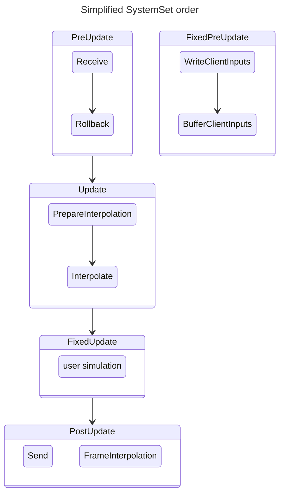
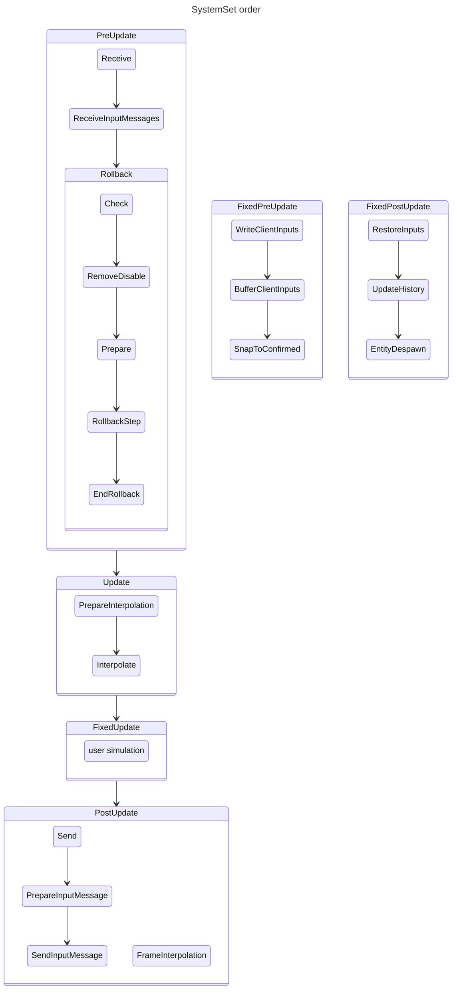

# System order

Lightyear provides several [`SystemSets`](bevy::prelude::SystemSet) that you can use to run your systems in the correct order.

The main things to keep in mind are:
- All packets are read during the `PreUpdate` schedule. This is also where replication updates are applied to the local world and where rollback happens.
- Network interpolation runs in the `Update` schedule (`InterpolationSystems::Prepare`, then `Interpolate`).
- All packets are sent during the `PostUpdate` schedule (`ReplicationSystems::Send`). All messages that were buffered are then sent to the remote, and all replication updates (entity spawn, component updated, etc.) are also sent.
- There are 2 [`SystemSets`](bevy::prelude::SystemSet) that you will interact with most:
  - [`InputSystems::WriteClientInputs`](crate::prelude::InputSystems): this is where you should write your inputs (in the `FixedPreUpdate` schedule) so that they are buffered and sent to the server correctly
  - plain `FixedUpdate`: this is where all your simulation systems (physics, movement, etc.) should run, so that they interact correctly with client-side prediction, etc.

Here is a simplified version of the system order:

```mermaid
---
title: Simplified SystemSet order
---
stateDiagram-v2

   PreUpdate --> Update
   Update --> FixedUpdate
   FixedUpdate --> PostUpdate
   state PreUpdate {
      Receive --> Rollback
   }
   state Update {
      PrepareInterpolation --> Interpolate
   }
   state FixedPreUpdate {
      WriteClientInputs --> BufferClientInputs
   }
   state FixedUpdate {
      Main: user simulation
   }
   state PostUpdate {
       Send
       FrameInterpolation
   }
```

## Full system order

```mermaid
---
title: SystemSet order
---
stateDiagram-v2

   PreUpdate --> Update
   Update --> FixedUpdate
   FixedUpdate --> PostUpdate
   state PreUpdate {
      Receive --> ReceiveInputMessages
      ReceiveInputMessages --> Rollback
   }
   state Rollback {
       Check --> RemoveDisable
       RemoveDisable --> Prepare
       Prepare --> RollbackStep
       RollbackStep --> EndRollback
   }
   state Update {
      PrepareInterpolation --> Interpolate
   }
   state FixedPreUpdate {
      WriteClientInputs --> BufferClientInputs
      BufferClientInputs --> SnapToConfirmed
   }
   state FixedUpdate {
      Main: user simulation
   }
   state FixedPostUpdate {
      RestoreInputs --> UpdateHistory
      UpdateHistory --> EntityDespawn
   }
   state PostUpdate {
        Send --> PrepareInputMessage
        PrepareInputMessage --> SendInputMessage
        FrameInterpolation
   }
```